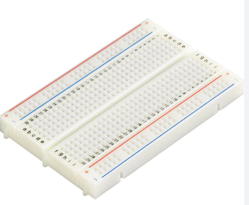

# Y9-IT-
Overview:
This project was created on an ESP32 and coded using visual studio code and Arduino, 

How to Use:
This project is done on an ESP32. Download the Zip file and open the terminal and type in Npm Run dev, this will give you the link to access the webpage.

Web server:
Web server is only the copy of Mr Z's original webpage design. 

Parts Used:

Temperature and Humidity Modifier:
 A temperature and humidity sensor are low cost-sensitive electronic devices that detects, measures and reports both dampness and air temperature. The proportion of moisture noticeable all around to the highest amount of moisture at a specific air temperature.

 

 Wires:
 Wires serve as the basic conduits for electrical signals. GPIO pins, representing the heart of connectivity, allow these wires to link the microcontroller to external components like sensors and actuators. These wires, typically associated with digital or analog signals, facilitate the exchange of information, enabling the ESP32 to receive input or convey output. 

Breadboard:
A breadboard is a prototyping board used in electronics to construct and test circuits quickly and easily without soldering. It consists of a grid of interconnected metal clips or spring terminals beneath the surface, allowing electronic components to be inserted into the board and connected together by simply placing wires or jumper cables into the holes.

